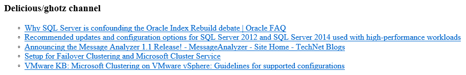
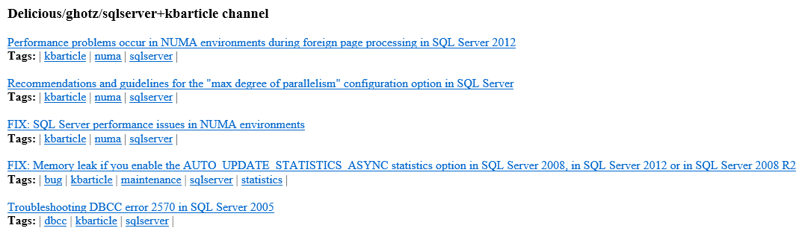
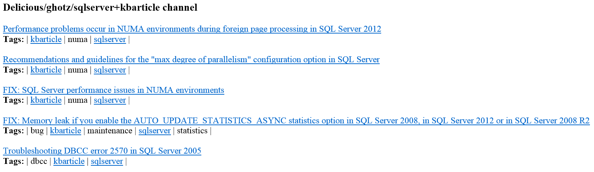
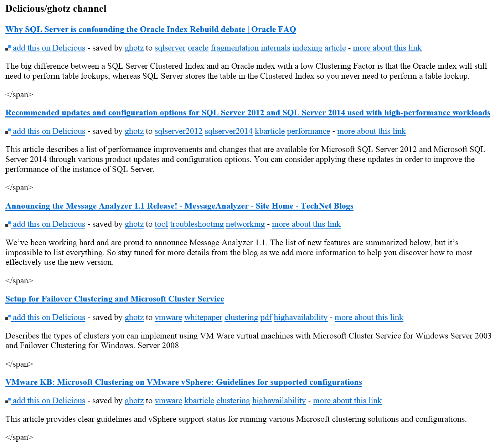

Delicious Bookmarks
===================
Plugin to parse Delicious bookmarks and associated tags.

Credits
------- 
Plugin skeleton code and inspiration from the following plugins:
* [github_actvity](https://github.com/getpelican/pelican-plugins/tree/master/github_activity)
* [goodreads_atvity](https://github.com/getpelican/pelican-plugins/tree/master/goodreads_activity)

Requirements
-------------
The plugin requires the installation of feedparser available at [https://crate.io/packages/feedparser/](https://crate.io/packages/feedparser "Feedparser website") or using
```
pip install feedreader
```

Usage
-----
To use this plugin, you first have to specify it in your configuration file as explained in the [How to use plugins][1] article in the official documentation.

Then you need to configure the plugin, again in the configuration file, using the following setting(s):

Setting Name                | What does it do
----------------------------| -------------------------------------------------------------------------
`DELICIOUS_BOOKMARKS_FEED`  | URL to Delicious RSS feed as specified in the official [documentation][2]

After configuring the plugin, you can access the `delicious_channel` dictionary using Jinja2 in your template, these are the keys exposed:

Key Name              | What does it represent
--------------------- | -------------------------------------
`title`               | Delicious channel name
`description`         | Delicious channel description
`bookmarks`           | Bookmarks dictionary

Keys in the `bookmarks` dictionary:

Key Name              | What does it represent
--------------------- | -------------------------------------
`title`               | Bookmark title
`description`         | Bookmark description
`link`                | Bookmark URL
`tags`                | Tags dictionary

Keys in the `tags` dictionary:

Key Name              | What does it represent
--------------------- | -------------------------------------
`term`                | Tag term
`scheme`              | Contains an URL representing the user channel 

Examples
--------

### Last n bookmarks by user ###

In the configuration file use the following setting:

```python
DELICIOUS_BOOKMARKS_FEED = 'http://feeds.delicious.com/v2/rss/{user}?count={1..100}'
```
replacing `{user}` with your user name in Delicious and `{1..100}` with the number of articles you want to parse; then insert the following Jinja2 code in your HTML template file:
```html

    <div class="delicious_bookmarks">
        <h3>{{ delicious_bookmarks.title }} channel</h3>
        <ul>
            
                <li><a href="{{ bookmark.link }}">{{ bookmark.title }}</a></li>
            
        </ul>
    </div><!-- /.delicious_bookmarks -->

```
This is how it will render using Pelican simple theme and the following configuration setting:
```python
DELICIOUS_BOOKMARKS_FEED = 'http://feeds.delicious.com/v2/rss/ghotz?count=5'
```


### Last n bookmarks by user and tags with links to Delicious ###

In the configuration file use the following setting:

```python
DELICIOUS_BOOKMARKS_FEED = 'http://feeds.delicious.com/v2/rss/{user}/{tag[+tag+...+tag]}?count={1..100}'
```
replacing `{user}` with your user name in Delicious, `{1..100}` with the number of articles you want to parse and `{tag[+tag+...+tag]}` with one or more tags concatenated with the plus sign; then insert the following Jinja2 code in your HTML template file:
```html

   <div class="delicious_bookmarks">
       <h3>{{ delicious_bookmarks.title }} channel</h3>
       
           <a href="{{ bookmark.link }}">{{ bookmark.title }}</a>
           <div class="tag-list">
               <b>Tags:</b> |
               
                   <a href="{{ btag.scheme }}{{ btag.term }}">{{ btag.term }}</a> |
               
           </div>
           <br />
       
   </div><!-- /.delicious_bookmarks -->

```

This is how it will render using Pelican simple theme and the following configuration setting:
```python
DELICIOUS_BOOKMARKS_FEED = 'http://feeds.delicious.com/v2/rss/ghotz/sqlserver+kbarticle?count=5'
```


### Last n bookmarks by user and tags with links to site tag pages ###

In the configuration file use the following setting:

```python
DELICIOUS_BOOKMARKS_FEED = 'http://feeds.delicious.com/v2/rss/{user}/{tag[+tag+...+tag]}?count={1..100}'
```
replacing `{user}` with your user name in Delicious, `{1..100}` with the number of articles you want to parse and `{tag[+tag+...+tag]}` with one or more tags concatenated with the plus sign; then insert the following Jinja2 code in your HTML template file:
```html

    <div class="delicious_bookmarks">
        <h3>{{ delicious_bookmarks.title }} channel</h3>
        
            <a href="{{ bookmark.link }}">{{ bookmark.title }}</a>
            <div class="tag-list">
                <b>Tags:</b> |
                
                    
                    
                        
                            
                        
                    
                    
                        {{ btag.term }} |
                    
                        <a href="{{ SITEURL }}/{{ tagurl }}">{{ btag.term }}</a> |
                    
                
            </div>
            <br />
        
    </div><!-- /.delicious_bookmarks -->

```
The idea here is that Delicious tags that are also defined among tags used by articles, get linked to the specic tag page generated by Pelican (other tags are simply written out without any specific link).

This is how it will render using Pelican simple theme and the following configuration setting:
```python
DELICIOUS_BOOKMARKS_FEED = 'http://feeds.delicious.com/v2/rss/ghotz/sqlserver+kbarticle?count=5'
```


Note: this plugin is my firt attempt at doing something with Python and Jinja2, I have a strong suspect that the bove Jinja2 code can be drastically simplified but I could not understand how to simply check for `btag.term` inclusion in `tags` without using an additional loop.

### Last n bookmarks by user with summary rendered by Delicious ###

In the configuration file use the following setting:

```python
DELICIOUS_BOOKMARKS_FEED = 'http://feeds.delicious.com/v2/rss/{user}?fancy&count={1..100}'
```
replacing `{user}` with your user name in Delicious and `{1..100}` with the number of articles you want to parse (note the addition of the `fancy` parameter in the URL); then insert the following Jinja2 code in your HTML template file:
```html

    <h3>{{ delicious_bookmarks.title }} channel</h3>
    
        <div class="bookmark">
            <b><a href="{{ bookmark.link }}">{{ bookmark.title }}</b>
            <p>{{ bookmark.summary }}</p>
        </div>
    
   </div><!-- /.delicious_bookmarks -->

```
This is how it will render using Pelican simple theme and the following configuration setting:
```python
DELICIOUS_BOOKMARKS_FEED = 'http://feeds.delicious.com/v2/rss/ghotz?fancy&count=5'
```


[1]: http://docs.getpelican.com/en/3.4.0/plugins.html#how-to-use-plugins "How to use plugins article"
[2]: https://delicious.com/rss "Delicious RSS & JSON documentation"
