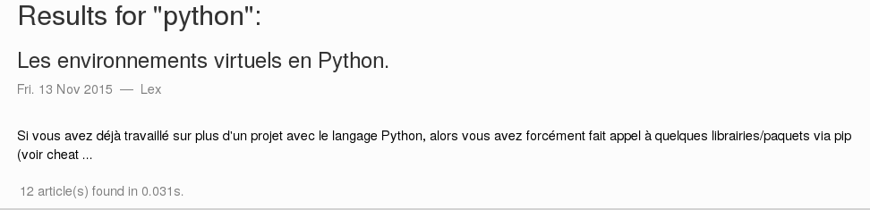

Shinxsearch for Pelican

The aim of this Pelican plugin is to provide a support of [Sphinxsearch](http://sphinxsearch.com/)
tool, allowing users to search keywords on the texts proposed on a website generated
with [Pelican](http://docs.getpelican.com/en/stable/) (a static site generator written in Python).

The main GitHub repository is [here](https://github.com/ysard/sphinxsearch-for-pelican).

The plugin itself is widely inspired from this nice work:

[Github: pelican-search](https://github.com/MTecknology/pelican-search/tree/master/pelican).

Here is a list of improvements:

- Support of Python 3.x
- Better support for html text with BeautifulSoup
- HTML and PHP templates for the search box and the results page
- Support of OR, AND, NOT query operators
- You don't need uwsgi application only for the search engine, a simple PHP server is the only requirement

# Installation of Python dependencies

This plugin needs `beautifulsoup4` module:

	pip install -r requirements.txt

# Template integration

Examples are available in the folder `site_files`.

An example of search box is in the file `search_box.html`;
you can include this template where you want in your theme;
preferably in the file `base.html` with this directive:

	

Few CSS rules are available in the file `search_box.css`.

Here is an example of what you can expect if you add them to your
own CSS rules:

---

For the results, a full PHP page is available in the file `search.php`.
This page handles form posts, does queries to Sphinxsearch engine,
and prints the results for the users.

You can modify the location of your Sphinxsearch engine, by updating
this line:

	$sphinx->setServer('localhost', 9312);

Here is an example of what you can expect:

---

Files `search.php` and `search_box.html` have to be
put in the directory `templates` of your theme.

Example:

	./pelican-themes/aboutwilson/templates

# Pelican configuration

In your `pelicanconf.py`, please add/update these lines:

	PLUGIN_PATHS = ['pelican-plugins']
	PLUGINS = ['sphinxsearch',]
	TEMPLATE_PAGES = {'search.php': 'search.php',}

# Sphinxsearch configuration

## Configuration file

Please edit the following file in the server:

	sudo nano /etc/sphinxsearch/sphinx.conf

The only file that will be indexed is named `sphinxsearch.xml` and it
appears in the folder `output` of the Pelican project when you update it.

Exemple of section for a website:

	source my_blog {
		type = xmlpipe2
		xmlpipe_command = cat /var/www/html/my_own_blog/sphinxsearch.xml
		xmlpipe_fixup_utf8 = 1
		xmlpipe_field = content
		xmlpipe_field = title
		xmlpipe_attr_string = title
		xmlpipe_attr_string = author
		xmlpipe_attr_string = url
		xmlpipe_attr_multi = category
		xmlpipe_attr_string = summary
		xmlpipe_attr_string = slug
		xmlpipe_attr_timestamp = published
	}

	index my_blog {
		type = plain
		source = my_blog
		path = /var/lib/sphinxsearch/data/
		charset_type = utf-8
		charset_table           = U+FF10..U+FF19->0..9, U+FF21..U+FF3A->a..z\
					, U+FF41..U+FF5A->a..z, 0..9, A..Z->a..z, a..z ,U+00C0->a, U+00C1->a\
					, U+00C2->a, U+00C3->a, U+00C4->a, U+00C5->a, U+00E0->a, U+00E1->a\
					, U+00E2->a, U+00E3->a, U+00E4->a, U+00E5->a, U+0100->a, U+0101->a\
					, U+0102->a, U+0103->a, U+010300->a, U+0104->a, U+0105->a, U+01CD->a\
					, U+01CE->a, U+01DE->a, U+01DF->a, U+01E0->a, U+01E1->a, U+01FA->a\
					, U+01FB->a, U+0200->a, U+0201->a, U+0202->a, U+0203->a, U+0226->a\
					, U+0227->a, U+023A->a, U+0250->a, U+04D0->a, U+04D1->a, U+1D2C->a\
					, U+1D43->a, U+1D44->a, U+1D8F->a, U+1E00->a, U+1E01->a, U+1E9A->a\
					, U+1EA0->a, U+1EA1->a, U+1EA2->a, U+1EA3->a, U+1EA4->a, U+1EA5->a\
					, U+1EA6->a, U+1EA7->a, U+1EA8->a, U+1EA9->a, U+1EAA->a, U+1EAB->a\
					, U+1EAC->a, U+1EAD->a, U+1EAE->a, U+1EAF->a, U+1EB0->a, U+1EB1->a\
					, U+1EB2->a, U+1EB3->a, U+1EB4->a, U+1EB5->a, U+1EB6->a, U+1EB7->a\
					, U+2090->a, U+2C65->a ,U+00C8->e, U+00C9->e, U+00CA->e, U+00CB->e\
					, U+00E8->e, U+00E9->e, U+00EA->e, U+00EB->e, U+0112->e, U+0113->e\
					, U+0114->e, U+0115->e, U+0116->e, U+0117->e, U+0118->e, U+0119->e\
					, U+011A->e, U+011B->e, U+018E->e, U+0190->e, U+01DD->e, U+0204->e\
					, U+0205->e, U+0206->e, U+0207->e, U+0228->e, U+0229->e, U+0246->e\
					, U+0247->e, U+0258->e, U+025B->e, U+025C->e, U+025D->e, U+025E->e\
					, U+029A->e, U+1D07->e, U+1D08->e, U+1D31->e, U+1D32->e, U+1D49->e\
					, U+1D4B->e, U+1D4C->e, U+1D92->e, U+1D93->e, U+1D94->e, U+1D9F->e\
					, U+1E14->e, U+1E15->e, U+1E16->e, U+1E17->e, U+1E18->e, U+1E19->e\
					, U+1E1A->e, U+1E1B->e, U+1E1C->e, U+1E1D->e, U+1EB8->e, U+1EB9->e\
					, U+1EBA->e, U+1EBB->e, U+1EBC->e, U+1EBD->e, U+1EBE->e, U+1EBF->e\
					, U+1EC0->e, U+1EC1->e, U+1EC2->e, U+1EC3->e, U+1EC4->e, U+1EC5->e\
					, U+1EC6->e, U+1EC7->e, U+2091->e ,U+00CC->i, U+00CD->i, U+00CE->i\
					, U+00CF->i, U+00EC->i, U+00ED->i, U+00EE->i, U+00EF->i, U+010309->i\
					, U+0128->i, U+0129->i, U+012A->i, U+012B->i, U+012C->i, U+012D->i\
					, U+012E->i, U+012F->i, U+0130->i, U+0131->i, U+0197->i, U+01CF->i\
					, U+01D0->i, U+0208->i, U+0209->i, U+020A->i, U+020B->i, U+0268->i\
					, U+026A->i, U+040D->i, U+0418->i, U+0419->i, U+1E09->c, U+212D->c\
					, U+2184->c
		mlock = 1
		enable_star = 1
		expand_keywords = 1
		phrase_boundary = ., ?, !, U+2026 # horizontal ellipsis
		preopen = 1
		html_strip = 1
		html_index_attrs = img=alt,title; a=title;
		html_remove_elements    = style, script
		min_word_len = 2
		stopwords = /var/lib/sphinxsearch/data/stopwords_fr.txt
		morphology            = libstemmer_french
	}

## Create/update the index

The first time the command for the initialization of the index is:

	sudo indexer --all

Next times, the command will be like this one:

	sudo /usr/bin/indexer --rotate --config /etc/sphinxsearch/sphinx.conf --all

You can update the `Makefile` of the Pelican project by adding this directive:

	update_sphinxsearch:
		@echo "Update Sphinxsearch index"
		sudo /usr/bin/indexer --rotate --config /etc/sphinxsearch/sphinx.conf --all

... and adding it to your favorite deployment directive with:

	$(MAKE) update_sphinxsearch

